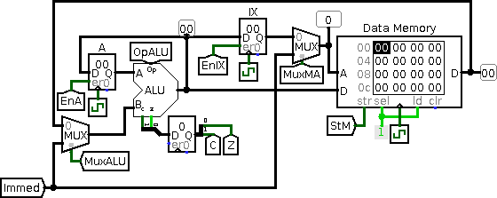
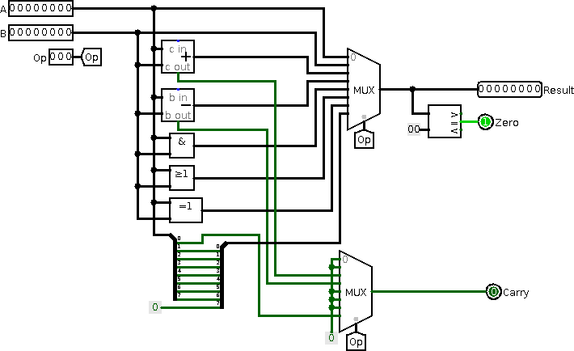
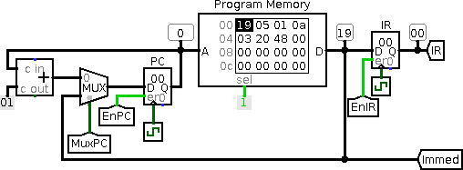
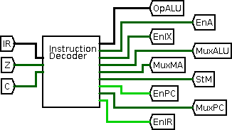
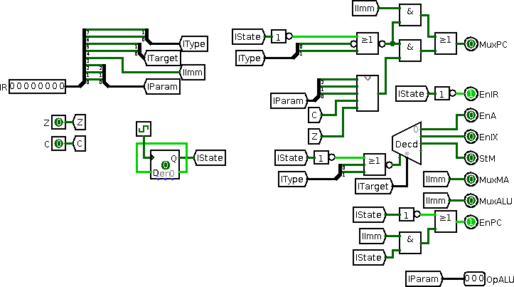

title: Logisim Prozessor
parent: uebersicht.md

# Allgemeines
Zur Übung wird ein Prozessor mit Hilfe von Logisim entwickelt.
Vorgaben:
- 8 Bit Register und Datenbus
- Befehlsformat: 8 Bit (mit optionaler 8 Bit Konstante hinter dem Befehl)
- Befehls- und Datenspeicher: jeweils 256 Bytes
- Register: Akkumulator A, Indexregister IX

Das [vollständige Prozessormodell für Logisim]({filename}prozessor.circ){: class="download" } steht für Übungszwecke zur Verfügung.

# Aufbau
## Datenpfad

Der Datenpfad stellt mittels Multiplexer und Enable Signale die Verbindung der einzelnen Register und Funktionseinheiten her. Im Datenpfad sieht man die Register (A, IX), die Arithmetisch-Logische Recheneinheit (kurz ALU) und den Datenspeicher.

### ALU
Die Arithmetisch-Logische Einheit besitzt zwei Eingänge für Operanden (A, B), einen Eingang zur Auswahl der durchzuführenden Rechenaoperation (OpALU), eine Ergebnisausgang und zwei Statusflags (Carry, Zero).

Übersicht über die Operationen:

**OpALU** | **Operation** | **Beschreibung**
-|-|-
000 | Result=A | Legt Operand A auf den Ausgang
001 | Result=B | Legt Operand B auf den Ausgang
010 | Result=A+B | Addiert A und B
011 | Result=A-B | Subtrahiert B von A
100 | Result=A AND B | Bitweise UND Verknüpfung
101 | Result=A OR B | Bitweise OR Verknüpfung
110 | Result=A EOR B | Bitweise Exclusive-OR Verknüpfung
111 | Result=A>>1 | Logisches Rechtsschieben von Operand A

Das Linksschieben ist nicht als eigene Operation angeführt. Dazu kann aber die Addition genutzt werden. Eine Addition von x mit x entspricht x*2 oder einer Linksschiebe-Operation.
Das Invertieren aller Bits kann auch mittels Exclusive-OR realisiert werden, indem die Exclusive-ODER Operation mit dem Register A und der Konstante 0xFF durchgeführt wird.

### MuxALU
Der Operand B der ALU kann entweder aus dem Datenspeicher stammen oder als Konstante aus dem Befehlsspeicher (*Immed*) kommen.

### MuxMA
Die Adresse des Datenspeichers kann entweder aus dem Indexregister *IX* oder als Konstante aus dem Befehlsspeicher kommen.

### EnA, En, StM
Die Signale *EnA* (*Enable A*), *EnIX* (*Enable IX*) und *StM* (*Store Memory*) dienen zur Speicherung der Daten. Eine *1* bewirkt die Übernahme der Daten vom Eingang des Registers in den Speicher des Registers (bei der nächsten steigenden Taktflanke).

## Beispiele
Betrachtet man nun nur den Datenpfad können verschiedene Operationen realisiert werden.

Befehl | EnA | EnIX | StM | MuxALU | MuxMA | OpALU | Beschreibung
-|-|-|-|-|-|-|-
ld A, *Imm.* | 1 | 0 | 0 | 1 | X | 001 | Lädt Register A mit Konstante *Imm.*
ld A, (IX) | 1 | 0 | 0 | 0 | 0 | 001 | Lädt Register A mit Wert an Adresse IX
ld A, (*Imm.*) | 1 | 0 | 0 | 0 | 1 | 001 | Lädt Register A Wert an der Adresse *Imm.*
ld IX, A | 0 | 1 | 0 | X | X | 000 | Lädt Register IX mit dem Wert aus Register A
ld IX, *Imm.* | 0 | 1 | 0 | 1 | X | 001 | Lädt Register IX mit der Konstante *Imm.*
st (IX), A | 0 | 0 | 1 | X | 0 | 000 | Speichert Register A an die Adresse IX
st (*Imm.*), A | 0 | 0 | 1 | X | 1 | 000 | Speichert Register A an die Adresse *Imm.*
add A, *Imm.* | 1 | 0 | 0 | 1 | X | 010 | Addiert zu Register A eine Konstante
add A, (IX) | 1 | 0 | 0 | 0 | 0 | 010 | Addiert zu Register A der Wert an Adresse IX
add A, (*Imm.*) | 1 | 0 | 0 | 0 | 1 | 010 | Addiert zu Register A der Wert an Adresse *Imm.*
nop | 0 | 0 | 0 | X | X | X | Führt keine Operation aus (No Operation)

## Steuerwerk

Das Steuerwerk dient zur Steuerung des Datenpfades.

### PC
Die Befehle werden mittels *PC* (*Program Counter*) adressiert. Das Register *PC* wird um eins erhöht, um den nächsten Befehl adressieren zu können. Bei einem Sprung wird das Register *PC* mit einer Konstante aus dem Befehlsspeicher geladen.

### Befehlsspeicher
Der Befehls- und Datenspeicher sind getrennt voneinander. Man spricht auch von getrennten Adressräumen. Dies entspricht dem Harvard-Modell.

### IR
Das Register *IR* (*Instruction Register*) speichert den aktuellen Befehl. Dies ist notwendig, da die Befehlsausführung in zwei Takten erfolgt.

Die Befehlsausführung geschieht in zwei Schritten:

1. **Fetch**: Der Befehl wird mittels *PC* adressiert, aus dem Befehlsspeicher geholt und im Register *IR* gespeichert.
2. **Decode and Execute**: Der Befehl wird dekodiert und ausgeführt. Dabei wird der Datenpfad entsprechend der Signale aus dem Instruktionsdekoder gesteuert.

## Instruktionsdekoder

Der Instruktionsdekoder ist Teil des Steuerwerks. Ein Befehl wird dekodiert und die entsprechenden Signale für Multiplexer, Register usw. gesetzt.

Beim internen Aufbau unseres Instruktionsdekoders sieht man, dass das Befehlsbyte in verschiedene Bereiche eingeteilt ist.

* **IType** (2 Bit): 00 - Datenoperation, 01 - Spungbefehl
* **ITarget** (2 Bit)): 00 - Speichert in Register A, 01 - Register IX, 10 - Datenspeicher, 11 - keine Speicherung
* **IImmed** (1 Bit): Der Befehl verwendet eine Konstante aus dem Befehlsspeicher
* **IParam** (3 Bit): Bei Datenoperationen: Wert für OpALU, bei Sprungbefehlen: Art des Bedingten Sprungs

Das im Befehlsspeicher enthaltene Programm dekodiert sich damit folgenderweise:

Adresse | Wert | Assembler | Bedeutung
-|-|-|-
0x00 | 0x19 | ld IX, 0x05 | Lädt IX mit der Konstante 0x05
0x01 | 0x05 | <code> </code> | Konstante gehört zum vorherigen Befehl
0x02 | 0x01 | ld A, (IX) | Lädt den Wert von der Adresse IX
0x03 | 0x0a | add A, 0x03 | Addiert zum Register A die Konstante 0x03
0x04 | 0x03 | <code> </code> | Konstante gehört zum vorherigen Befehl
0x05 | 0x20 | st (IX), A | Speicher Register A an der Adress IX
0x06 | 0x48 | jmp 0x03 | Springe zur Adresse 0x03
0x07 | 0x03 | <code> </code> | Konstante gehört zum vorherigen Befehl

# Einschränkungen
Unser Prozessorbeispiel beinhaltet weit nicht alle Funktionen eines mächtigeren Prozessors. So fehlt etwa ein Stackpointer oder die Möglichkeit, das *PC* Register zu sichern. Dies wäre notwendig, um aus Subroutinen zurückzukehren.
