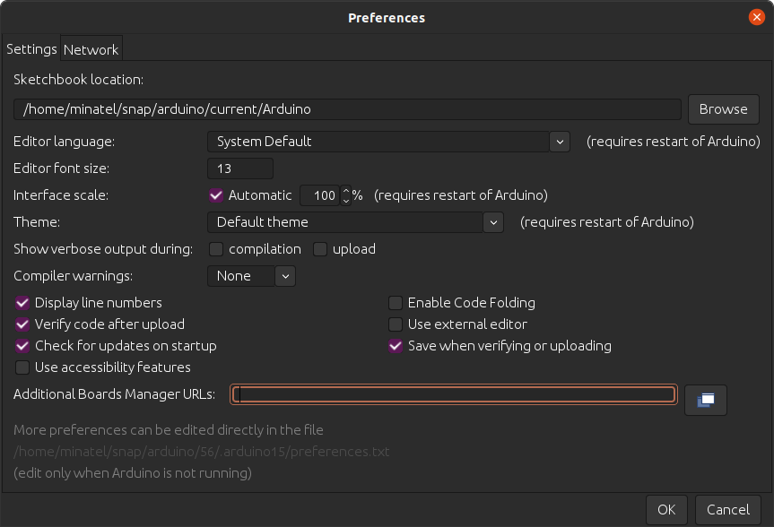

title: Installation ESP32
parent: ../../uebersicht.md

# Installation der Arduino IDE

Über die offizielle [Arduino](https://www.arduino.cc/en/software) Seite die IDE herunterladen und installieren.

## ESP32 Board Support

Mittels "File" → "Preferences" wird über "Additional Board Manager URLs" folgende URL hinzugefügt:

    https://raw.githubusercontent.com/espressif/arduino-esp32/gh-pages/package_esp32_index.json

## ESP32 Board auswählen

Mittels "Tools" → "Board: *...*" wird folgendes ESP32 Board ausgewählt: "ESP32 Dev Module"

## Erstes Beispiel

    #!c
    #define LED_GPIO 12

    void setup() {
      pinMode(LED_GPIO, OUTPUT);
    }

    void loop() {
      digitalWrite(LED_GPIO, HIGH);
      delay(300);
      digitalWrite(LED_GPIO, LOW);
      delay(300);
      while(1);
    }

Auf dem Steckbrett werden folgende Verbindungen gemacht:

* **Pin 12** über Vorwiderstand zur Anode der LED
* **Pin GND** zur Kathode der LED (abgeflacht Seite) 

## USB Treiber

Es kann je nach Windows Version notwendig sein, einen USB RS232 Treiber zu installieren. Dieser kann hier heruntergeladen werden: [Silicon Labs CP210x](https://www.silabs.com/developers/usb-to-uart-bridge-vcp-drivers)

## Kompilieren und Upload

Mittels "Sketch" → "Verify/Compile" wird das Projekt compiliert. Anschließend mittels "Sketch" → "Upload" (oder mittels <kbd>Strg+U</kbd>).