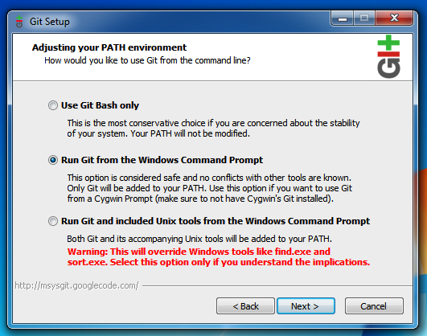

title: Übung Github/Gitlab

# Notwendige Vorbereitungen
1. Anlegen eines Benutzeraccounts auf [GitHub](http://github.com) bzw. [GitLab](http://gitlab.com)
1. Installation von [VS Code](https://code.visualstudio.com/)
1. Installation von [Git (for Windows)](https://gitforwindows.org/) mit <code>PATH</code> Variable (Option 2 oder 3)!

# Begriffe
* Commit
* Commit Hash
* Branch
* Mergen
* Merge Request/Pull Request
* Fork

# Übung [GitLab](http://gitlab.com)
## Teil 1 - Eigenes Projekt
1. Anlegen des Projektes "WDIC Übung"
1. Anlegen eines *Issues* (z.B. "Improve README")
1. Aus diesem Issue einen *Merge Request* erstellen
1. Diesen *Merge Request* bearbeiten (z.B. ändern der README Datei in der WebIDE)
1. *Mergen* des *Merge Request* 
1. Herunterladen der Dateien als Zip-Datei

## Teil 2 - Mitarbeit an einem anderen Projekt
1. *Forken* des Projektes https://gitlab.com/jehle.guenther/gitlab-avr-example
1. Hinzufügen des eigenen Namens im README (unter Developers)
1. Erstellen eines *Merge Requests* in das ursprüngliche Projekt

## Teil 3 - Mitarbeit am gemeinsamen Projekt
Arbeit in zweier (evtl. dreier) Teams

1. Hinzufügen eines anderen Mitglieds (unter *Project Information* -> *Members*)
1. Erstellen eines Issues und bearbeiten eines Merge Requests im jeweils anderen Projekt
  * Bearbeiten der README -> Markdown Funktionalitäten austesten (Überschriften, Links, Kursiv, Fett, Emojis, ...)
1. Zuweisen eines *Reviewers*
1. *Approven* des Merge Requests
1. *Mergen* des *Merge Requests*

# Übung [Github](http://github.com)
## Teil 1
1. Anlegen des Projektes "WDIC Übung"
1. Anlegen eines *Issues* (z.B. "Improve README")
1. Aus diesem Issue einen neuen Branch erstellen (im Issue in der rechten Sidebar unter "Development") 
1. Diesen *Branch* bearbeiten (z.B. ändern der README Datei)
1. Erstellen eines *Pull Requests*
1. *Mergen* des *Pull Requests*
1. Herunterladen der Dateien als Zip-Datei