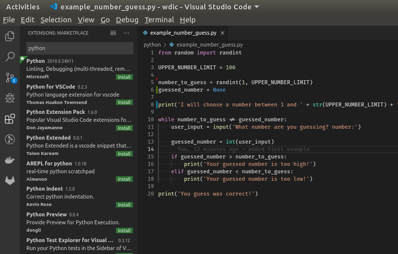

title: Installation
parent: uebersicht.md
next: beispiele.md

# Vorbereitungen fürs Tutorial
Für das Tutorial ist es egal, unter welcher Plattform gearbeitet wird (Windows/Linux/MacOS/...). Um eine gemeinsame Basis für die Entwicklungsumgebung zu bieten, möchte ich euch **Visual Studio Code** (nicht zu verwechseln mit *Visual Studio*!) empfehlen.

# Installation Visual Studio Code
Hier geht's zum Download: [Visual Studio Code Download](https://code.visualstudio.com/download) . Wählt die für euch passende Plattform aus und führt die Installation durch.

# Installation Python
Wir benötigen eine Python Installation mit Version >= 3.6.

Es gibt viele Möglichkeiten Python zu installieren und manche Plattformen liefern Python direkt mit (MacOS/Linux). Sollte dies nicht der Fall sein oder nur eine alte Version vorhanden sein, gibt es eine Downloadmöglichkeit hier: [Python Download](https://www.python.org/downloads/)

**Wichtig**: Unter Windows sollte der Pfad zu Python in der <code>PATH</code> Umgebungsvariable sein. Dazu bei der Installation folgende Option setzen:

# Visual Studio Code Erweiterung für Python

Nach dem Start von Visual Studio Code gibt es auf der linken Seite eine Toolbar. Dort "Extensions" auswählen und nach "python" suchen und installieren.

# Test der Installation

1. Erstelle eine neue Datei (<kbd>Ctrl</kbd> + <kbd>n</kbd>)
2. Schreibe folgendes in diese Datei: <code>print('Hello world!')</code>
3. Speichern dieser Datei (<kbd>Ctrl</kbd> + <kbd>s</kbd>) unter <code>test.py</code>
4. Ausführen dieser Datei mittels <kbd>Ctrl</kbd> + <kbd>F5</kbd>
5. Unten sollte im Terminal (neben anderen Meldungen) <code>Hello world!</code> erscheinen