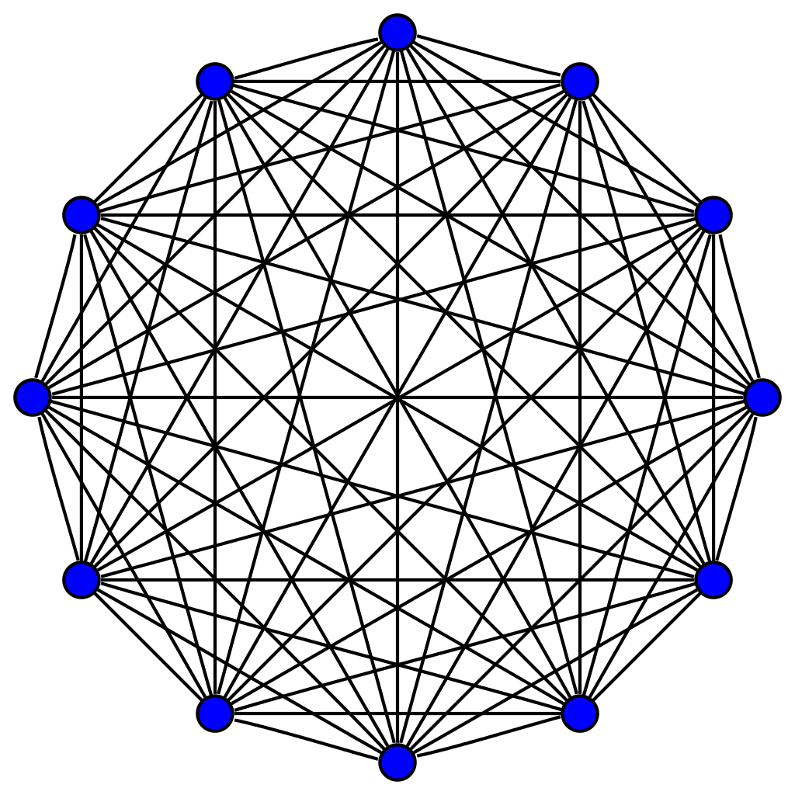
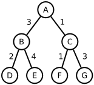
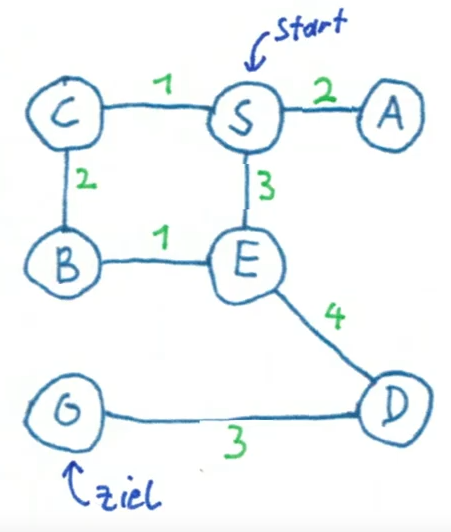
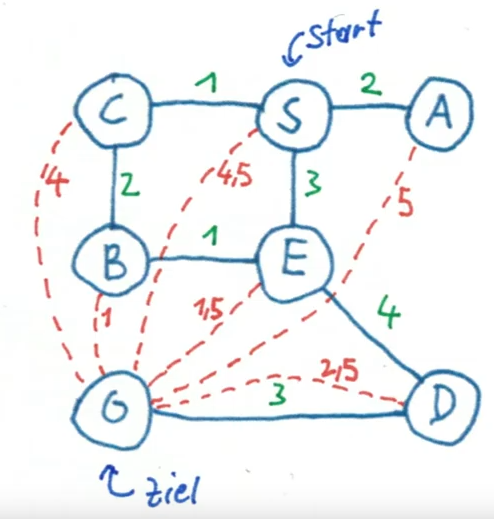

# Suche

---

### Beispiel 1 - Der Paketdienst

* Am Anfang der Fahrt erhält er 20 Pakete, die er während des Tages ausliefern muss
* Fragestellung: Was ist die beste Route? <!-- .element: class="fragment" -->
* Wieviel Möglichkeiten gibt es? <!-- .element: class="fragment" -->

---

 <!-- .element height="30%" width="30%" -->

<small>Bildquelle: [Wikipedia](https://commons.wikimedia.org/wiki/File:11-simplex_graph.svg) von [Koko90](https://commons.wikimedia.org/wiki/User:Koko90)</small>

Hier die möglichen Wege für nur 11 Pakete...

---

* Für die erste Fahrt gibt es 20 Möglichkeiten, für die zweite 19, ...
* Also gibt es 20 * 19 * 18 * 17 * 16 * ... * 2 Möglichkeiten <!-- .element: class="fragment" -->
* also 20! (sprich 20 Fakultät) <!-- .element: class="fragment" -->

---

* Angenommen wir schaffen 1 Milliarde Möglichkeiten pro Sekunde zu berechnen...
* ... benötigen wir über 77 Jahre <!-- .element: class="fragment" -->

---

### Beispiel 2 - Königsberger Brückenproblem

<small>Bildquelle: [Wikipedia](https://commons.wikimedia.org/wiki/File:Konigsberg_bridges.png) von Bogdan Giuşcă)</small>

* Frage: Gibt es einen Weg, bei dem man alle sieben Brücken genau einmal überquert? <!-- .element: class="fragment" -->
* Bonusfrage: Gibt es einen Rundweg folgend dieser Bedingung? <!-- .element: class="fragment" -->

Notes: Königsberg war die Hauptstadt Ostpreußens. Nach 1945 wurde die nun russische Stadt in Kaliningrad umbenannt.

---

Leonhard Euler bewies 1736, dass ein solcher Weg nicht möglich ist.

* Es dürfte maximal zwei Ufer mit einer ungeraden Zahl von angeschlossenen Brücken geben. <!-- .element: class="fragment" -->
* Diese zwei Ufer könnten Ausgangs- bzw. Endpunkt sein. <!-- .element: class="fragment" -->
* Nicht möglich ist ein "Rundweg" (auch Eulerweg genannt). <!-- .element: class="fragment" -->

<small>Die Anfänge der Graphentheorie gehen auf dieses Problem zurück.</small> <!-- .element: class="fragment" -->

---

### Graphentheorie

<small>Ein *Graph* ist eine abstrakte Struktur, die eine Menge von Objekten (genannt Knoten) zusammen mit den zwischen diesen Objekten bestehenden Verbindungen (genannt Kanten) repräsentiert.</small>

Notes: Weitere Beispiele: Buslinien, Stammbaum, State-Machines...
---

### Eigenschaften von Graphen

* Kanten: gerichtet - ungerichtet, gewichtet - ungewichtet <!-- .element: class="fragment" -->
* Zyklen <!-- .element: class="fragment" -->
* Planar <!-- .element: class="fragment" -->

---

### Baum

* kreisfrei (azyklisch) <!-- .element: class="fragment" -->
* Spezialfall: Binärer Baum - darf höchstens zwei untergeordnete Knoten haben <!-- .element: class="fragment" -->
* Begriffe: Wurzel, Ast, Blatt <!-- .element: class="fragment" -->

---

## Uninformierte Suche

---

### Breiten- und Tiefensuche

<iframe width="560" height="315" src="https://www.youtube.com/embed/7RCp2jNwxjQ" title="YouTube video player" frameborder="0" allow="accelerometer; autoplay; clipboard-write; encrypted-media; gyroscope; picture-in-picture; web-share" allowfullscreen></iframe>

---

## Informierte Suche

---

### Branch-and-Bound

<small>Unnötige Äste im Suchbaum werden nicht weiter untersucht (abgeschnitten)</small>

<iframe width="560" height="315" src="https://www.youtube.com/embed/5D4pjWX56Po" title="YouTube video player" frameborder="0" allow="accelerometer; autoplay; clipboard-write; encrypted-media; gyroscope; picture-in-picture; web-share" allowfullscreen></iframe>

Notes:
---

### A* Algorithmus

<small>Es wird eine Heuristik (Abschätzung) verwendet, um die Suche zu optimieren</small>

* Beispiele: Luftlinie, Kostenabschätzung, ...
* Wichtige Bedingung: Eine Heuristik muss immer **optimistisch** sein

Notes:

---

### A* Beispiel

<iframe width="560" height="315" src="https://www.youtube.com/embed/fI9PGLoRE2E" title="YouTube video player" frameborder="0" allow="accelerometer; autoplay; clipboard-write; encrypted-media; gyroscope; picture-in-picture; web-share" allowfullscreen></iframe>

<small>Für weitere Beispiele siehe [Graph Search Visualizer](https://huakunshen.github.io/GraphSearchVisualizer/)</small>

---

### Huffman Kodierung

<iframe width="560" height="315" src="https://www.youtube.com/embed/6vgkip3z83s" title="YouTube video player" frameborder="0" allow="accelerometer; autoplay; clipboard-write; encrypted-media; gyroscope; picture-in-picture; web-share" allowfullscreen></iframe>